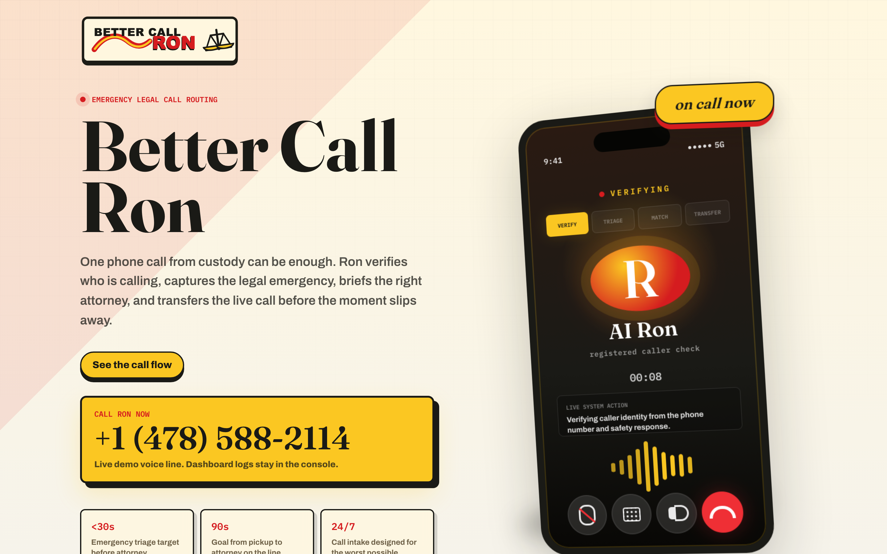
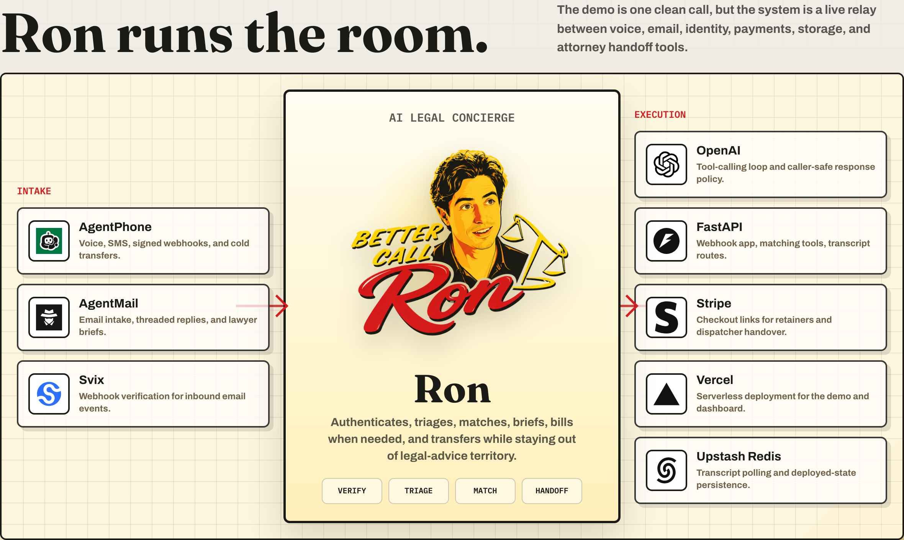
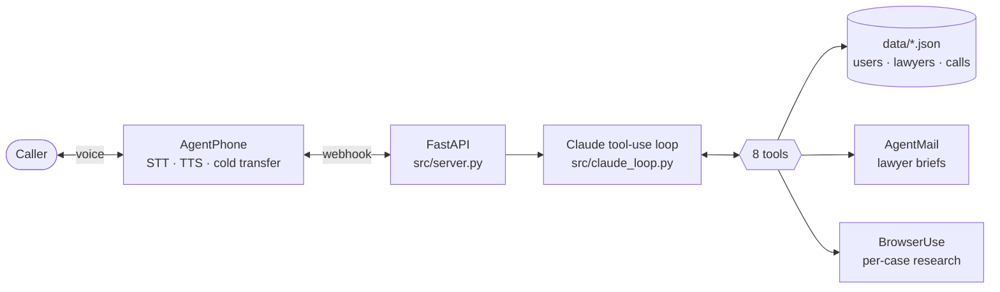

<div align="center">

# Better Call Ron

### Voice-first AI lawyer concierge

*"Hey, this is Ron. How can I help you?"*

[](./tests)
[](./pyproject.toml)
[](#stack)
[](https://www.ycombinator.com/)

**[→ Live: better-call-ron-hackathon.vercel.app](https://better-call-ron-hackathon.vercel.app)**

<br />

<a href="https://better-call-ron-hackathon.vercel.app">
  
</a>

<br /><br />

<a href="https://better-call-ron-hackathon.vercel.app">
  
</a>

</div>

---

> [!IMPORTANT]
> **Headline demo scenario — one phone call from jail.** Ron picks up, authenticates the caller via caller-ID (or name + DOB when calling from someone else's phone), triages the situation in under 30 seconds, briefs the matched attorney by email, and cold-transfers the live call — all in under 90 seconds.

## How it works

Ron picks the path from the caller's own words — no menus, no DTMF.

| Path | When | What Ron does | Target |
|---|---|---|---|
| **Urgent** | Arrest, custody, crisis | Match attorney → email brief → cold-transfer → SMS emergency contact (same turn) | < 90s pickup to attorney |
| **Shopper** | Browsing / researching | Per-case BrowserUse web research → email resource pack → optional match + connect | Conversational pace |

Read the [PRD](./PRD.md) for the full product spec.

## Architecture



### Tool surface

| Tool | Purpose |
|---|---|
| `lookup_user` | Resolve caller from phone (caller-ID) or name + DOB |
| `match_lawyers` | Deterministic rules+score cascade — **not an LLM** |
| `connect_to_lawyer` | Email brief to lawyer, then cold-transfer the live call |
| `research_and_email` | BrowserUse research run for the caller's specific case, emailed via AgentMail |
| `notify_emergency_contact` | SMS / iMessage to caller's emergency contacts (urgent flow) |
| `end_call` | Clean hangup |
| `escalate_to_human` | Route to dispatcher |
| `route_to_public_defender` | Route unknown callers to the PD hotline |

## Docs

| Doc | Purpose |
|---|---|
| [**PRD.md**](./PRD.md) | Product requirements, scenarios, data model, FRs/NFRs |
| [**IMPLEMENTATION_PLAN.md**](./IMPLEMENTATION_PLAN.md) | Concrete build doc — files, responsibilities, order |
| [**CLAUDE.md**](./CLAUDE.md) | Project guide for Claude Code sessions |

## Quick start

```bash
# 1. Install
python -m venv .venv && source .venv/bin/activate
pip install -e ".[dev]"

# 2. Fill in secrets
cp .env.example .env
# Edit .env with real keys (see PRD §10.2)

# 3. Run tests (expect 53 passed)
pytest -v

# 4. Run the API server
uvicorn src.server:app --reload --port 8000

# 5. Expose to AgentPhone via ngrok
ngrok http 8000
# Copy the https URL into AgentPhone's webhook config
# and into .env's WEBHOOK_PUBLIC_URL
```

## Operator admin panel

Brand-styled React + Vite + TypeScript console for monitoring live calls and reviewing history. Run alongside the FastAPI server:

```bash
cd frontend
npm install
npm run dev          # http://localhost:5173
```

<details>
<summary><strong>What's in the panel</strong></summary>

<br />

- **Live Transcripts** — WebSocket-streamed transcripts of active calls, with urgency-derived badges, filter chips, and auto-follow newest
- **History** — every past call with derived urgency / status, click-to-expand turn-by-turn transcript and tool log
- **Users** / **Lawyers** — read-only views of the seed data

Urgency is *derived* from Ron's tool sequence in `data/calls/<id>.json` — no prompt change required:

| Observed | Derived urgency |
|---|---|
| `research_and_email` invoked | **shopper** |
| `match_lawyers` first, no research | **urgent** |
| Neither | **unclear** |

Status comes from the last non-error terminal tool:

| Last terminal tool | Derived status |
|---|---|
| `end_call` | **completed** |
| `connect_to_lawyer` | **transferred** |
| `escalate_to_human` / `route_to_public_defender` | **escalated** |
| (none succeeded) | **dropped** |

</details>

## Layout

```
src/
├── server.py              FastAPI app, AgentPhone webhook, interim-transcript debounce
├── claude_loop.py         AsyncAnthropic tool-use loop (with prompt caching)
├── tools.py               Tool implementations
├── matcher.py             Deterministic rules+score lawyer matching
├── prompts.py             Ron's system prompt + persona/voice rules
├── schemas.py             Pydantic models
├── call_history.py        Read-only derivations for the admin panel
├── agentphone_client.py   AgentPhone SDK wrapper + HMAC signature verification
├── agentmail_client.py    Email transport (AgentMail)
├── browseruse_client.py   Browser-use SDK wrapper
├── call_log.py            Per-call event log
└── transcript_bus.py      Live transcript pub/sub

frontend/                  React + Vite + TS admin panel
data/
├── users.json             Seeded user fixtures
├── lawyers.json           Seeded lawyer fixtures
└── calls/                 Per-call JSON logs (gitignored)
public/transcript.html     Live transcript page for stage projection
tests/                     pytest suite (matcher + tools + signature + claude_loop)
assets/                    Landing page screenshots, pitch slide
```

<h2 id="stack">Stack</h2>

| Layer | Choice |
|---|---|
| LLM | Anthropic Claude — `claude-sonnet-4-6` (Opus 4.7 quality fallback), with ephemeral prompt caching on system + tools |
| Telephony | [AgentPhone](https://agentphone.ai) — STT, TTS, SMS, signed webhooks, cold transfer |
| Email | [AgentMail](https://agentmail.to) — lawyer briefs + caller resource packs |
| Browsing | [BrowserUse](https://browser-use.com) — live web research per case |
| Backend | FastAPI + Pydantic, Python 3.11+ |
| Frontend | React + Vite + TypeScript + Tailwind (Anthropic brand palette) |
| Persistence | JSON files (no DB) |
| Tests | pytest |

---

<div align="center">

Built for **Y Combinator's "Call My Agent" Hackathon** · May 2026

</div>
